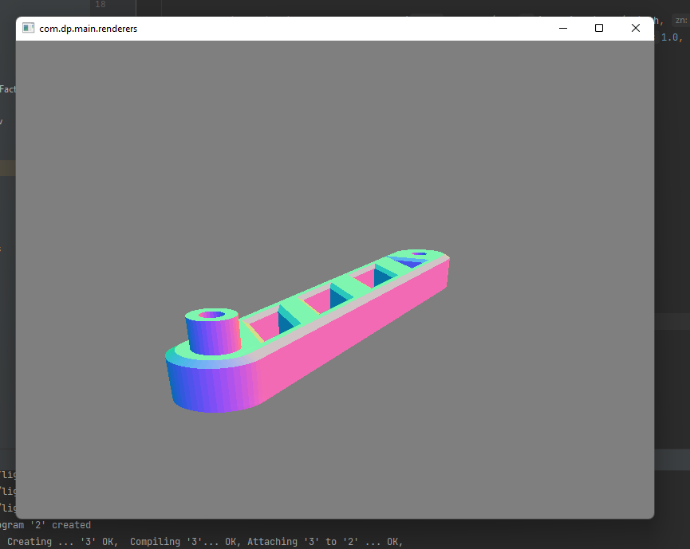
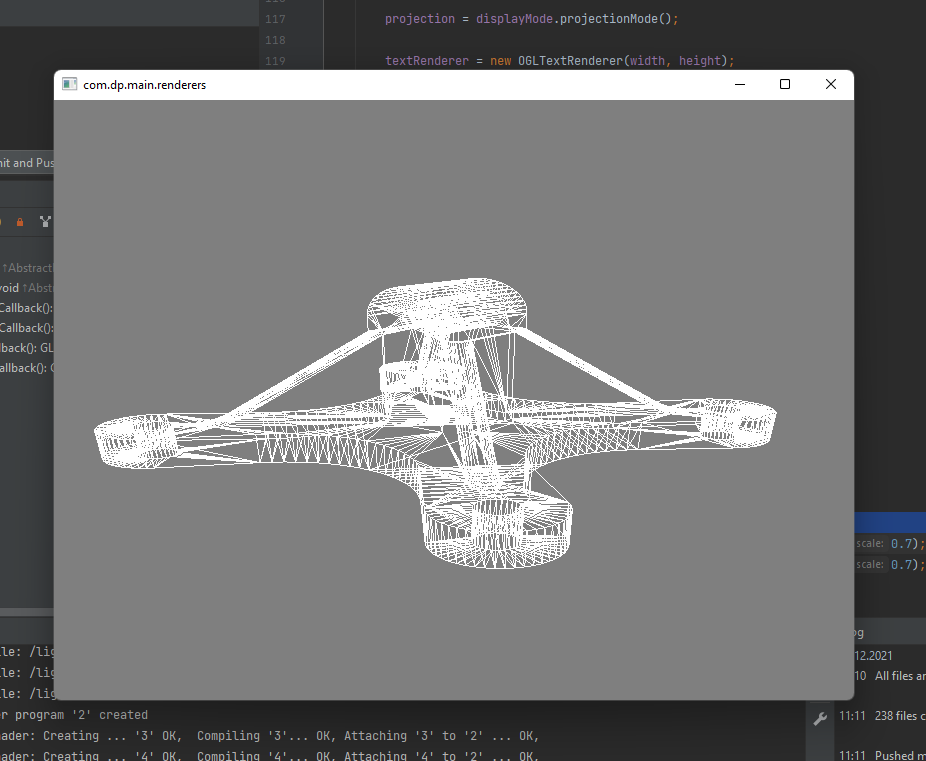

# PGRF3-II

Druhá úloha: načtení STL souboru, rozparsová a zobrazení modelu. Ukázkové soubory pro načtení jsou v adresáři [STL FILES](https://github.com/podzimekdavid/STLViewer-OpenGL/tree/master/STL%20files).

## Ovládání
| Klávesa     | Funkce         |
|-------------|----------------|
| 1           | Fill / Lines   |
| 2           | Debug mode     |
| 3           | Projekce       |
| 5           | Barvy          |
| 6           | Pohled světla  |
| 9           | Načtení tělesa |
| W,S,A,D,R,F | Pohyb          |
| +/-         | Scale          |
| Šipky       | Rotace         |
| B,N,M       | Složky světla  |

##Obrázky

*2021 - David Podzimek (uhk\podzida1)*
